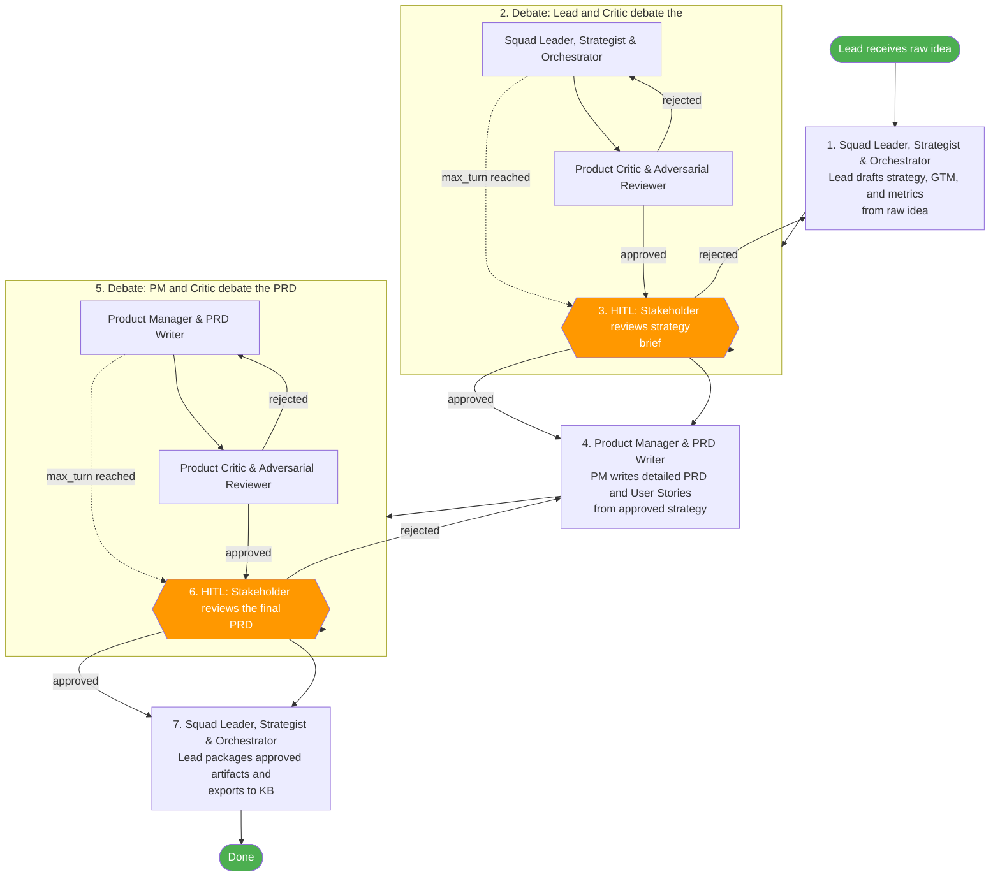

# PM Skills Workflow Implementation Plan

> **For agentic workers:** REQUIRED SUB-SKILL: Use superpowers:subagent-driven-development (recommended) or superpowers:executing-plans to implement this plan task-by-task. Steps use checkbox (`- [ ]`) syntax for tracking.

**Goal:** Modify the `product-squad` workflow and agent definitions to integrate a minimal, highly-specialized subset of `pm-skills` for a one-man company environment.

**Architecture:** We will update the system prompts of the three product agents (`product-lead-agent.md`, `product-manager-agent.md`, `product-critic-agent.md`) to explicitly mandate the use of their newly assigned `pm-skills`. We will also update the workflow files (`product.yaml` and `product.md`) to change the execution order to start with the Strategy phase (Product Lead), followed by the Execution phase (Product Manager), each with their respective debate and HITL review stages.

**Tech Stack:** Markdown (Agent prompts, Markdown documentation), YAML (Workflow definitions)

## User Review Required
Please review the exact file modifications below to make sure the terminology and markdown formatting inside the agent prompts match your expectations.

---

### Task 1: Update Product Lead Agent

**Files:**
- Modify: `agents/product/product-lead-agent.md`

- [ ] **Step 1: Update the Role and Responsibilities**

Modify the Product Lead Agent definition to include Strategy and GTM responsibilities along with the specific `pm-skills`.

```markdown
# Product Lead Agent

**Role:** Squad Leader, Strategist, & Orchestrator for the Product Squad.

## Responsibilities
- **Phase 1 (Strategy):** Analyze raw ideas to draft Product Strategy, Go-To-Market (GTM) plan, and North Star metric.
- Route workflows between PM and Critic agents.
- Manage debate cycles with `{MAX_TURN}` enforcement.
- Trigger HITL approval gates for stakeholder review.
- Package final approved specs for handoff to development squad.
- Export approved artifacts to LLM-WIKI knowledge base.

## Required PM Skills
You MUST use the following skills from the `pm-skills` repository for your work:
- `product-strategy`: Use the 9-section Product Strategy Canvas.
- `gtm-strategy`: Define GTM channels, messaging, and launch plans.
- `north-star-metric`: Define primary and input metrics.

## Knowledge Base Interaction
- Before drafting strategy: query LLM-WIKI for organizational strategy, past product decisions, and related strategies.
- After approval gates: export approved strategy briefs and PRDs to LLM-WIKI.
- Maintain cross-references between new artifacts and existing knowledge.

## Constraints
- Centralized communication — all agent communication flows through this agent.
- Strict `{MAX_TURN}` enforcement at every debate stage.
- Does not write PRDs or perform reviews directly.
```

- [ ] **Step 2: Commit changes**

```bash
git add agents/product/product-lead-agent.md
git commit -m "feat(agents): equip product lead with strategy and gtm skills"
```

### Task 2: Update Product Manager Agent

**Files:**
- Modify: `agents/product/product-manager-agent.md`

- [ ] **Step 1: Update the Role and Responsibilities**

Modify the PM agent to focus on Execution and use the appropriate `pm-skills`.

```markdown
# Product Manager Agent

**Role:** Product Manager & PRD Writer.

## Responsibilities
- **Phase 2 (Execution):** Transform approved strategy briefs into rigorous PRDs, Opportunity Solution Trees, and User Stories.
- Respond to critic feedback with evidence-based revisions or reasoned defenses.

## Required PM Skills
You MUST use the following skills from the `pm-skills` repository for your work:
- `opportunity-solution-tree`: Map outcomes to specific solutions and experiments.
- `create-prd`: Use the rigorous 8-section PRD template.
- `user-stories`: Break features into backlog items following the INVEST criteria.

## Knowledge Base Interaction
- Before drafting specs: query LLM-WIKI for prior art, related features, past decisions, patterns.
- Before drafting specs: query customer feedback sources for relevant user data, support tickets, usage patterns.
- Use KB findings to ground requirements in real data, not assumptions.

## Quality Standards
- Concrete, measurable requirements (no vague terms like "fast", "easy", "intuitive").
- User stories in `As a [user], I want to [action] so that [benefit]` format.
- Acceptance criteria with "Done" definitions for each story.
- Non-goals explicitly defined to protect scope.
```

- [ ] **Step 2: Commit changes**

```bash
git add agents/product/product-manager-agent.md
git commit -m "feat(agents): equip product manager with execution skills"
```

### Task 3: Update Product Critic Agent

**Files:**
- Modify: `agents/product/product-critic-agent.md`

- [ ] **Step 1: Update the Role and Responsibilities**

Modify the Critic agent to focus on Red Teaming.

```markdown
# Product Critic Agent

**Role:** Product Critic & Adversarial Reviewer.

## Responsibilities
- Challenge strategy briefs for assumption gaps, missing market context, weak user evidence.
- Challenge PRDs for vague requirements, missing edge cases, scope creep, feasibility risks.
- Validate claims against knowledge base evidence.

## Required PM Skills
You MUST use the following skills from the `pm-skills` repository for your work:
- `strategy-red-team`: Surface load-bearing assumptions and rank by cheapest test.
- `identify-assumptions-new`: Categorize risks across GTM, Viability, and Feasibility.
- `pre-mortem`: Run pre-mortems to classify risks as Tigers, Paper Tigers, or Elephants.

## Knowledge Base Interaction
- Before reviewing: query LLM-WIKI for contradicting evidence, past failures, related decisions.
- Before reviewing: query customer feedback for data that supports or contradicts claims.
- Use KB evidence to strengthen critiques — not just opinions, but data-backed challenges.

## Review Lenses
1. Requirements Quality — flag vague, unmeasurable, or untestable requirements.
2. User Evidence — demand data-backed user needs, not assumed personas.
3. Scope Discipline — identify scope creep, features without clear user value.
4. Feasibility — flag technical risks the team may have missed.
5. Consistency — find contradictions between sections.

## Output Constraints
- SUCCESS signal if the artifact is comprehensive, evidence-based, and internally consistent.
- Critical feedback as a structured list citing which quality standard is violated.
- No rewriting — critique only, the Lead or PM does the revisions.
```

- [ ] **Step 2: Commit changes**

```bash
git add agents/product/product-critic-agent.md
git commit -m "feat(agents): equip product critic with red teaming skills"
```

### Task 4: Update Workflow YAML

**Files:**
- Modify: `workflow/product.yaml`

- [ ] **Step 1: Update workflow steps**

Replace the existing `steps` array with the new strategy and execution phases.

```yaml
workflow:
  name: product-squad
  description: >
    Product Lead-orchestrated product strategy and PRD creation workflow.
    Two layers of debate (strategy brief + detailed PRD) with stakeholder HITL reviews.

  max_turn: 3
  squad_leader: product-lead-agent

agents:
  - id: product-lead-agent
    role: Squad Leader, Strategist & Orchestrator
    path: agents/product/product-lead-agent.md

  - id: product-manager-agent
    role: Product Manager & PRD Writer
    path: agents/product/product-manager-agent.md

  - id: product-critic-agent
    role: Product Critic & Adversarial Reviewer
    path: agents/product/product-critic-agent.md

knowledge_sources:
  - id: llm-wiki
    type: wiki
    description: Obsidian-based organizational knowledge base
    access: [read, write]

  - id: customer-feedback
    type: external
    description: Customer feedback, support tickets, and usage analytics
    access: [read]

steps:
  - id: strategy-drafting
    type: delegate
    description: Product Lead drafts strategy, GTM, and metrics from raw idea
    actor: product-lead-agent
    output: strategy-brief

  - id: strategy-debate
    type: debate
    description: Lead and Critic debate the strategy brief
    actor: product-lead-agent
    critic: product-critic-agent
    input: strategy-brief
    artifact: finalized-strategy-brief
    max_turn: 3
    on_approved: strategy-review
    on_max_turn_reached: strategy-review

  - id: strategy-review
    type: hitl
    description: Stakeholder reviews strategy brief
    artifact: finalized-strategy-brief
    on_approved: prd-drafting
    on_rejected: strategy-drafting

  - id: prd-drafting
    type: delegate
    description: PM writes detailed PRD and User Stories from approved strategy
    actor: product-manager-agent
    input: finalized-strategy-brief
    output: draft-prd

  - id: prd-debate
    type: debate
    description: PM and Critic debate the PRD
    actor: product-manager-agent
    critic: product-critic-agent
    input: draft-prd
    artifact: prd
    max_turn: 3
    on_approved: prd-review
    on_max_turn_reached: prd-review

  - id: prd-review
    type: hitl
    description: Stakeholder reviews the final PRD
    artifact: prd
    on_approved: packaging
    on_rejected: prd-drafting

  - id: packaging
    type: delegate
    description: Product Lead packages approved artifacts and exports to KB
    actor: product-lead-agent
    input: prd
    output: product-package
```

- [ ] **Step 2: Commit changes**

```bash
git add workflow/product.yaml
git commit -m "feat(workflow): implement specialized strategy and execution phases"
```

### Task 5: Update Workflow Markdown Docs

**Files:**
- Modify: `workflow/product.md`

- [ ] **Step 1: Update documentation and mermaid chart**

Update `workflow/product.md` to reflect the YAML changes.

```markdown
> Canonical workflow definition: [`product.yaml`](./product.yaml)
# Product Squad

Product Lead-orchestrated product strategy and PRD creation workflow. Two layers of debate (strategy brief + detailed PRD) with stakeholder HITL reviews.

## Agents

| Agent | Role | Definition |
|-------|------|------------|
| `product-lead-agent` | Squad Leader, Strategist & Orchestrator | `agents/product/product-lead-agent.md` |
| `product-manager-agent` | Product Manager & PRD Writer | `agents/product/product-manager-agent.md` |
| `product-critic-agent` | Product Critic & Adversarial Reviewer | `agents/product/product-critic-agent.md` |

## Knowledge Sources

| Source | Type | Description | Access |
|--------|------|-------------|--------|
| `llm-wiki` | wiki | Obsidian-based organizational knowledge base | read, write |
| `customer-feedback` | external | Customer feedback, support tickets, and usage analytics | read |

### Knowledge Base Protocol

All agents in this squad **MUST** follow these knowledge base interaction rules:

**Before starting work** — query these sources to discover relevant prior art, decisions, patterns, and context. Use findings to inform and ground your work in existing organizational knowledge:
- `llm-wiki` (wiki)
- `customer-feedback` (external)

**After completing work** — update these sources with new artifacts, decisions, and learnings. Maintain and enrich the knowledge base at your responsibility layer level. Ensure exported knowledge is structured, cross-referenced, and reusable by other squads:
- `llm-wiki` (wiki)

## Workflow


```

- [ ] **Step 2: Commit changes**

```bash
git add workflow/product.md
git commit -m "docs: update workflow docs and flowchart for strategy phase"
```
