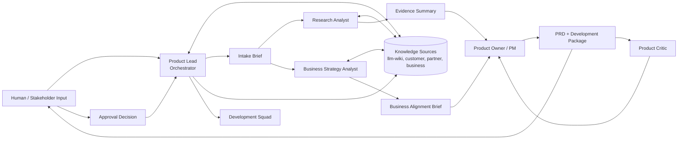
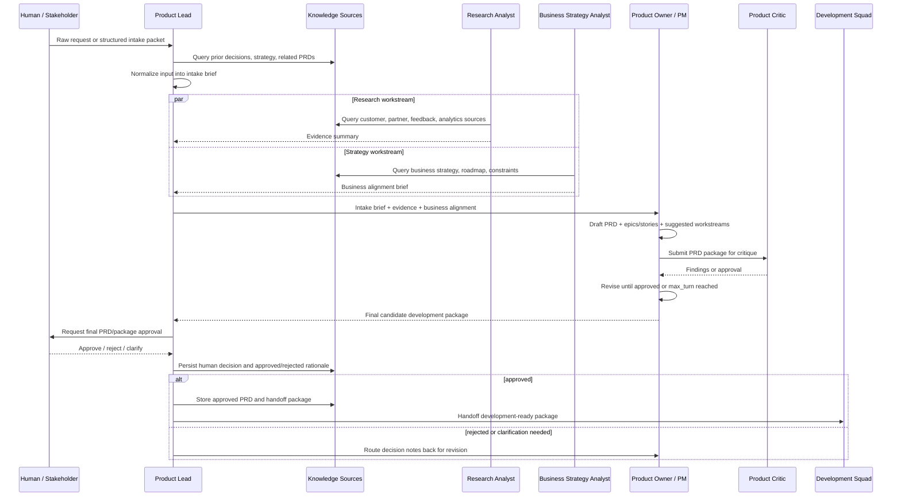

# Product Discovery Workflow Replacement Design

## Overview

Replace the current `workflow/product.yaml` with a hybrid product discovery squad that behaves more like a real product team before PRD handoff. The workflow accepts either raw human input or a structured intake packet, normalizes it, runs research and business strategy analysis in parallel, synthesizes a PRD plus development-ready package, reviews it through a critic loop, requests final human approval, persists decisions and artifacts to the knowledge base, then hands the package to the development squad.

This design reuses the existing workflow engine concepts: `delegate`, `fanout`, `debate`, and `hitl`. No schema change is required.

## Goals

- Replace the current simple product workflow, not create a parallel workflow.
- Model a realistic product discovery flow with customer, partner, and business strategy inputs.
- Support independent parallel product tasks before PRD writing.
- Persist every meaningful artifact and human decision to writable knowledge sources.
- Produce a development-ready package, not only an approved PRD.
- Keep the first version small enough to maintain and validate.

## Non-Goals

- Do not model a full product organization with many specialized roles.
- Do not add new workflow step types unless implementation proves the current types insufficient.
- Do not automate stakeholder approval beyond the existing HITL workflow pattern.
- Do not bypass the development workflow's responsibility for SRS, architecture, implementation planning, and execution.

## Architecture

## Agents

### `product-lead-agent`

Squad leader and orchestrator. Owns input normalization, workflow routing, artifact persistence, HITL review, human decision capture, and final handoff to the development squad. The Product Lead does not write the PRD directly.

### `product-manager-agent`

Product Owner / Product Manager. Owns synthesis of the intake brief, evidence summary, and business alignment brief into the PRD and development-ready package. Produces epics, user stories, acceptance criteria, non-goals, risks, open questions, and suggested parallel implementation workstreams.

### `product-research-agent`

Research analyst. Collects and synthesizes customer, partner, support, feedback, and usage evidence. Produces an evidence summary with sources, confidence level, gaps, and conflicting signals. Does not write the PRD.

### `business-strategy-agent`

Business strategy analyst. Checks business goals, roadmap fit, constraints, partner impact, priority, expected outcomes, and strategic risks. Produces a business alignment brief. Does not write the PRD.

### `product-critic-agent`

Adversarial reviewer. Reviews the PRD and development-ready package for weak evidence, vague or untestable requirements, stakeholder ambiguity, contradictions, scope creep, business misalignment, and unclear development handoff.

## Knowledge Sources

`workflow/product.yaml` should keep using declarative `knowledge_sources`, expanded to cover:

- `llm-wiki`: writable organizational knowledge base for prior decisions, approved artifacts, decision logs, and reusable product knowledge.
- `customer-feedback`: readable customer feedback, support tickets, and usage analytics.
- `partner-input`: readable partner documents, partner constraints, and partner commitments.
- `business-strategy`: readable business goals, roadmap context, priorities, and strategic constraints.

Writable sources must receive all meaningful artifacts and all human decision records. Read-only sources must be cited where they influence the product output.

## Workflow Sequence

## Replacement Workflow Steps

1. `intake-normalization` (`delegate`): Product Lead converts raw request or structured packet into `intake-brief`.
2. `discovery-fanout` (`fanout`): Research Analyst and Business Strategy Analyst work in parallel from the same intake brief.
3. `artifact-persistence-discovery` (`delegate`): Product Lead stores the intake brief, evidence summary, and business alignment brief in writable knowledge sources.
4. `prd-synthesis` (`delegate`): Product Manager creates PRD plus development-ready package.
5. `prd-package-debate` (`debate`): Product Manager and Product Critic review and revise the PRD package.
6. `artifact-persistence-prd` (`delegate`): Product Lead stores draft PRD/package versions, critique outcomes, and unresolved findings.
7. `final-prd-review` (`hitl`): Human approves, rejects, or requests clarification on the final candidate package.
8. `decision-persistence` (`delegate`): Product Lead stores the human decision, rationale, reviewer identity if available, timestamp, and approved/rejected artifact references.
9. `development-handoff` (`delegate`): Product Lead stores the final approved package and hands it to the development squad.

## Artifacts

### `intake-brief`

Normalized problem, requester, stakeholders, source input, assumptions, constraints, missing information, and initial scope boundary.

### `evidence-summary`

Customer, partner, support, feedback, and usage evidence. Includes source citations, confidence level, evidence gaps, and conflicting signals.

### `business-alignment-brief`

Business objective, strategic fit, priority rationale, partner impact, constraints, expected outcome, and strategic risks.

### `prd`

Problem, solution, personas, user stories, acceptance criteria, non-goals, AI/system requirements where applicable, technical context, rollout, and risks.

### `development-ready-package`

Approved PRD plus epics/stories, suggested parallel implementation workstreams, evidence links, decision log, open questions, non-goals, risks, and handoff notes for the development squad.

## Quality Gates

- The Product Manager must not draft the PRD from raw input alone. PRD synthesis requires the intake brief, evidence summary, and business alignment brief.
- The Product Critic must evaluate evidence quality, stakeholder ambiguity, requirement testability, business alignment, scope discipline, and development handoff clarity.
- Final human review is the only required HITL gate.
- Every human approval, rejection, clarification, and rationale must be persisted to writable knowledge sources.
- Every meaningful artifact must be persisted to writable knowledge sources. Draft artifacts must be marked as draft or superseded when later versions replace them.
- If final review rejects the package, Product Lead persists the rejection and routes the decision notes back to PRD synthesis.

## Error Handling

- If raw input is vague, Product Lead still creates an intake brief, marks missing information explicitly, and asks the human for clarification only when the gap blocks useful research.
- If a knowledge source is unavailable, the responsible agent records the gap, confidence impact, and fallback assumptions.
- If research produces conflicting evidence, the Research Analyst must preserve the conflict instead of smoothing it over.
- If the Critic rejects until `max_turn`, the latest package advances to final human review with unresolved findings attached.
- If human review rejects the package, Product Lead persists the rejection record and routes the work back to `prd-synthesis`.

## Testing And Verification

- `python -m src.cli validate workflow/product.yaml` must pass after replacement.
- Rendering `workflow/product.yaml` must generate product markdown containing all new agents, the fanout step, final HITL review, artifact persistence, decision persistence, and development handoff.
- Existing workflow schema tests should continue to pass because no new step type is required.
- Add or update renderer tests for the new product workflow structure and knowledge base protocol.
- Add or update content-level assertions that `workflow/product.md` mentions the expected artifacts and persistent human decision capture.

## Implementation Notes

- Prefer updating the existing product agent files where the role identity remains compatible.
- Add new agent definition files only for the two new specialist roles: `product-research-agent` and `business-strategy-agent`.
- Keep `product-manager-agent` as the ID unless implementation finds that renaming to `product-owner-agent` would not break synchronization or tests.
- Update `workflow/product.md` from the YAML renderer instead of editing generated markdown by hand.
