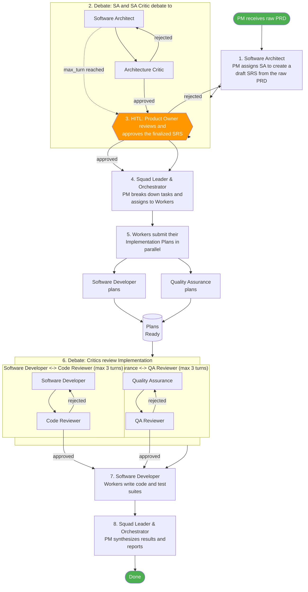

> Canonical workflow definition: [`orchestrator-debate.yaml`](./orchestrator-debate.yaml)
# Orchestrator Debate

PM-orchestrated multi-agent debate workflow for SDLC. Two debate layers (architecture + implementation) with HITL gate.

## Agents

| Agent | Role | Definition |
|-------|------|------------|
| `pm-agent` | Squad Leader & Orchestrator | `agents/management/pm-agent.md` |
| `sa-agent` | Software Architect | `agents/solution_architect/sa-agent.md` |
| `sa-critic-agent` | Architecture Critic | `agents/solution_architect/sa-critic-agent.md` |
| `coder-agent` | Software Developer | `agents/coding/coder.md` |
| `code-critic-agent` | Code Reviewer | `agents/coding/code-critic.md` |
| `qa-agent` | Quality Assurance | `agents/qa/qa.md` |
| `qa-critic-agent` | QA Reviewer | `agents/qa/qa-critic.md` |

## Knowledge Sources

| Source | Type | Description | Access |
|--------|------|-------------|--------|
| `codebase` | repository | Project source code and documentation | read, write |
| `llm-wiki` | wiki | Obsidian-based organizational knowledge base | read, write |

### Knowledge Base Protocol

All agents in this squad **MUST** follow these knowledge base interaction rules:

**Before starting work** — query these sources to discover relevant prior art, decisions, patterns, and context. Use findings to inform and ground your work in existing organizational knowledge:
- `codebase` (repository)
- `llm-wiki` (wiki)

**After completing work** — update these sources with new artifacts, decisions, and learnings. Maintain and enrich the knowledge base at your responsibility layer level. Ensure exported knowledge is structured, cross-referenced, and reusable by other squads:
- `codebase` (repository)
- `llm-wiki` (wiki)

## Workflow

