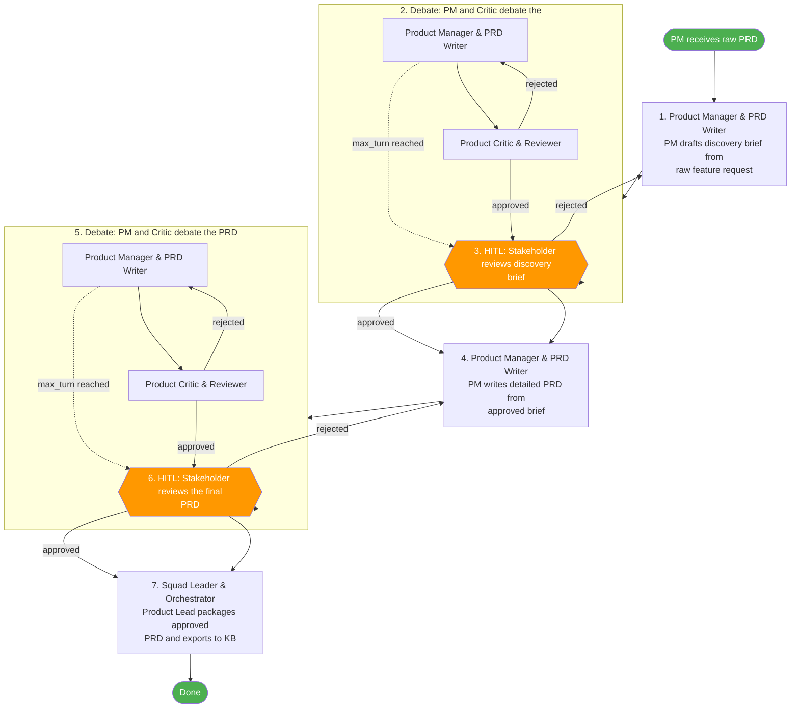

> Canonical workflow definition: [`product-squad.yaml`](./product-squad.yaml)
# Product Squad

Product Lead-orchestrated product discovery and PRD creation workflow. Two layers of debate (discovery brief + detailed PRD) with stakeholder HITL reviews.

## Agents

| Agent | Role | Definition |
|-------|------|------------|
| `product-lead-agent` | Squad Leader & Orchestrator | `agents/product/product-lead.md` |
| `product-manager-agent` | Product Manager & PRD Writer | `agents/product/product-manager.md` |
| `product-critic-agent` | Product Critic & Reviewer | `agents/product/product-critic.md` |

## Knowledge Sources

| Source | Type | Description | Access |
|--------|------|-------------|--------|
| `llm-wiki` | wiki | Obsidian-based organizational knowledge base | read, write |
| `customer-feedback` | external | Customer feedback, support tickets, and usage analytics | read |

### Knowledge Base Protocol

All agents in this squad **MUST** follow these knowledge base interaction rules:

**Before starting work** — query these sources to discover relevant prior art, decisions, patterns, and context. Use findings to inform and ground your work in existing organizational knowledge:
- `llm-wiki` (wiki)
- `customer-feedback` (external)

**After completing work** — update these sources with new artifacts, decisions, and learnings. Maintain and enrich the knowledge base at your responsibility layer level. Ensure exported knowledge is structured, cross-referenced, and reusable by other squads:
- `llm-wiki` (wiki)

## Workflow

